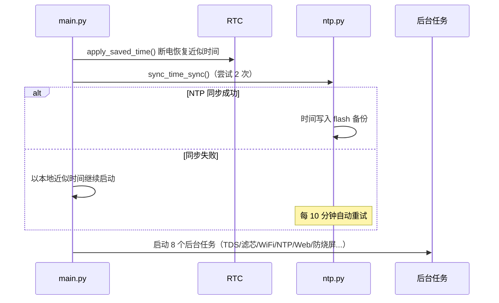
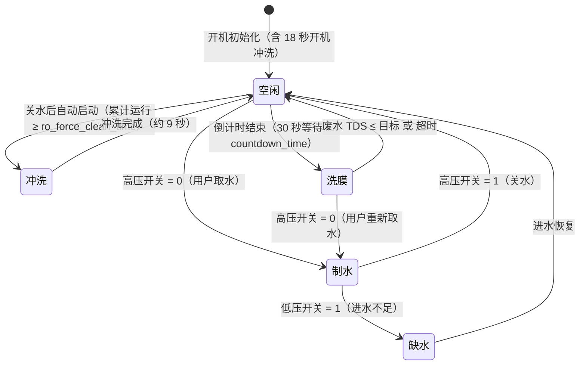
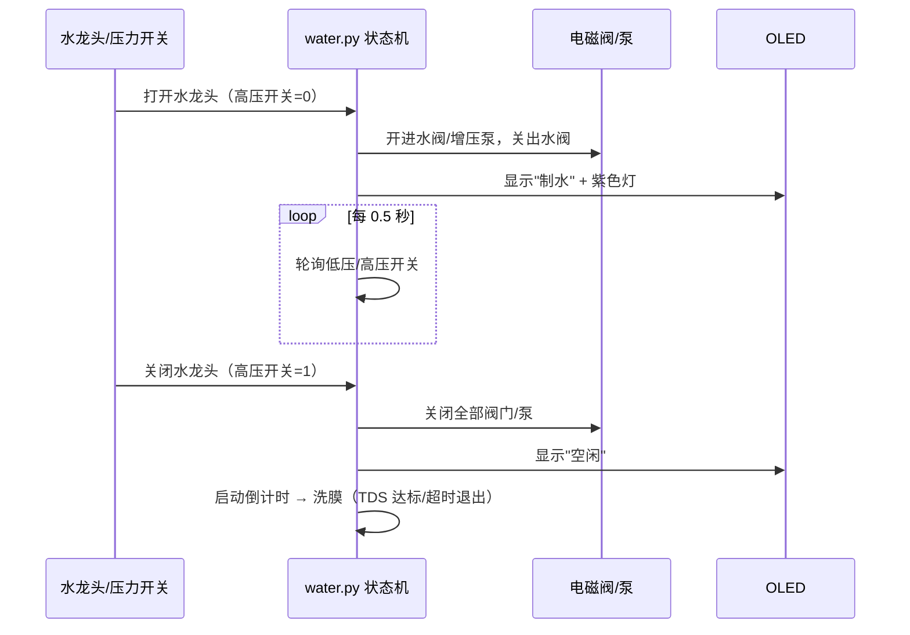
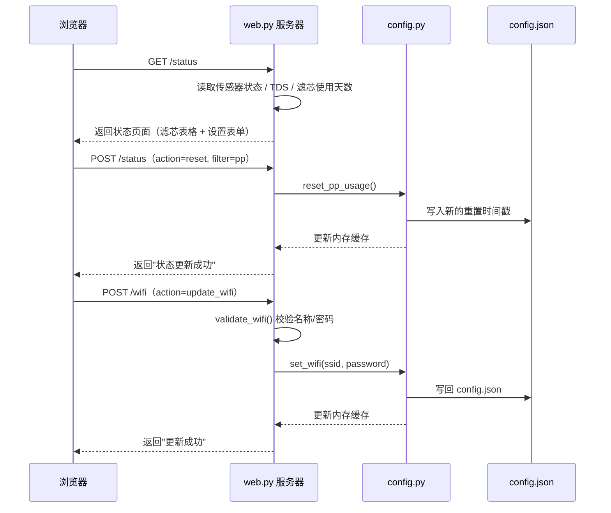

# ESP32-S3 净水器固件（MicroPython）

基于 **MicroPython + asyncio** 的 RO 反渗透净水器控制固件，运行于 **ESP32-S3** 开发板。

主要功能：

- 制水自动控制（低压/高压开关状态机）
- RO 膜强制冲洗、开机冲洗
- 纯水泡膜（洗膜）自动流程（TDS 达标/超时退出）
- 双通道 TDS / 水温监测（UART 传感器）
- SSD1306 OLED 中文界面（128×64）
- OLED 防烧屏：像素偏移 + 夜间自动熄屏 + 亮度控制
- 内置 Web 管理服务器（端口 80）：滤芯状态、参数设置、WiFi 配置、日志下载
- WiFi 自动连接/断线重连，NTP 自动校时
- 断电时间备份（软件近似时钟），离线也能启动
- 双核并行：阻塞硬件操作（OLED/TDS/WiFi）运行在第二核线程

---

## 目录

1. [硬件接线](#硬件接线)
2. [烧录与部署](#烧录与部署)
3. [目录结构](#目录结构)
4. [启动流程](#启动流程)
5. [制水与冲洗逻辑](#制水与冲洗逻辑)
6. [纯水泡膜（洗膜）](#纯水泡膜洗膜)
7. [OLED 界面与防烧屏](#oled-界面与防烧屏)
8. [Web 管理](#web-管理)
9. [配置说明](#配置说明)
10. [日志系统](#日志系统)
11. [时间与断电备份](#时间与断电备份)
12. [开发注意事项](#开发注意事项)
13. [常见问题](#常见问题)
14. [版本历史](#版本历史)
15. [第三方组件与许可](#第三方组件与许可)

---

## 硬件接线

引脚定义见 [pins.py](pins.py)，接线如下：

| 外设 | 引脚 | 说明 |
|---|---|---|
| 高压开关 | GPIO4（上拉输入） | 0 = 压力未达标（正在制水）；1 = 压力达标（水龙头关闭） |
| 低压开关 | GPIO5（上拉输入） | 1 = 进水压力不足（缺水） |
| 压力桶进水电磁阀 | GPIO11（输出） | |
| 压力桶出水电磁阀 | GPIO12（输出） | |
| 增压泵 | GPIO9（输出） | |
| 废水阀 | GPIO10（输出） | |
| 进水电磁阀 | GPIO13（输出） | |
| TDS 传感器 | UART1：TX=GPIO17，RX=GPIO18，9600bps | 双通道协议（见 [tds.py](tds.py)） |
| OLED | SoftI2C：SDA=GPIO1，SCL=GPIO2 | SSD1306 128×64 |
| RGB LED | GPIO48 | WS2812B 单灯（见 [ws2812b.py](ws2812b.py)） |

RGB LED 颜色含义：

| 状态 | 颜色 |
|---|---|
| 制水 | 紫色 (199,18,184) |
| 冲洗 RO 膜 | 黄色 |
| 缺水 | 红色 |
| 纯水泡膜 | 绿色 |
| 空闲 | 熄灭 |

---

## 烧录与部署

1. **烧录 MicroPython 固件**：使用 ESP32-S3 官方或社区固件（建议 8MB flash 版本，如 DevKitC-1）。
2. **同步代码**：任选一种
   - VS Code + MicroPico 插件（项目已含 [.vscode/settings.json](.vscode/settings.json) 的运行/同步按钮配置）；
   - 命令行工具：`mpremote cp -r . :` 或 ampy。
3. **首次上电**：程序找不到有效 [config.json](config.json) 时自动生成默认配置（WiFi：`esp32` / `12345678`），可通过 Web 页面（`http://<设备IP>/wifi`）修改。
4. **注意**：`config.json` 与运行时文件（`logs/`、`time_state.txt`）已被 .gitignore 排除，不会提交到仓库。

---

## 目录结构

| 文件/目录 | 说明 |
|---|---|
| [main.py](main.py) | 入口：时间恢复 → WiFi → NTP → 启动全部任务 |
| [boot.py](boot.py) | 空（MicroPython 启动钩子） |
| [config.py](config.py) / config.json | 配置读写与校验（含滤芯重置时间戳） |
| [pins.py](pins.py) | GPIO / UART 引脚定义 |
| [water.py](water.py) | 制水状态机、强制冲洗、开机冲洗、纯水泡膜、TDS 刷新 |
| [tds.py](tds.py) | TDS 传感器帧协议（0x55 帧 + 校验和，双通道） |
| [countdown.py](countdown.py) | 洗膜倒计时（分钟/秒双模式显示） |
| [web.py](web.py) | 内嵌 HTTP 服务器（端口 80） |
| [wifi.py](wifi.py) | WiFi 连接、断线重连监控 |
| [ntp.py](ntp.py) | NTP 校时（阿里云服务器）、定时同步 |
| [oled.py](oled.py) | SSD1306 显示、中文字库绘制、防烧屏任务 |
| [log.py](log.py) | 日志缓冲/刷盘/轮换，带传感器状态前缀 |
| [time_utils.py](time_utils.py) | 时间工具、断电时钟备份/恢复 |
| [timer.py](timer.py) | 制水累计运行计时（毫秒） |
| [watchdog.py](watchdog.py) | 硬件看门狗（10 秒超时） |
| [cartridge_usage_time.py](cartridge_usage_time.py) | 各滤芯使用天数计算 |
| [threadsafe_context.py](threadsafe_context.py) | 双核线程调度上下文（外设/内部硬件） |
| lib/threadsafe/ | Peter Hinch 线程安全原语（队列/事件/Context） |
| [font.py](font.py) | 中文/ASCII 点阵字库 |
| [ssd1306.py](ssd1306.py) | SSD1306 标准驱动 |
| [ws2812b.py](ws2812b.py) | WS2812B 灯带封装 |
| [test.py](test.py) | 调试版主程序（OLED 显示 SSID/密码，便于排查网络） |

---

## 启动流程

`main.py` 的启动顺序：

1. **恢复断电前时间**：若有备份（`/time_state.txt`）且为上电复位，先用近似时间恢复 RTC（误差 = 断电时长）；
2. 启动日志轮换、日志刷盘、**每小时时间备份**任务；
3. 连接 WiFi（最多等待约 5 分钟）；
4. **NTP 校时**：尝试 2 次；失败不再阻塞，以本地近似时间继续启动，之后每 10 分钟自动重试；
5. 初始化 OLED 静态界面；
6. 启动后台任务：
   - 滤芯使用时间刷新（每 60 秒）
   - TDS / 水温刷新（每 1 秒）
   - WiFi 状态监控（每 30 秒，断线自动重连）
   - NTP 定时同步（每天 4 点校准；失败则 10 分钟重试）
   - Web 服务器
   - OLED 像素偏移 / 夜间熄屏（防烧屏）
7. 开机冲洗 RO 膜（18 秒）；
8. 进入制水主循环（0.5 秒轮询压力开关）。

**启动时序图**（Mermaid 语法，GitHub 网页自动渲染）：

---

## 制水与冲洗逻辑

状态机位于 [water.py](water.py) 的 `start_water_production()`：

| 条件 | 动作 |
|---|---|
| 低压开关 = 1（缺水） | 停止制水，停止强制冲洗任务，等待进水恢复（红色灯 + "缺水"） |
| 高压开关 = 0 且未在制水 | **开始制水**：开进水阀/压力桶进水阀/增压泵，关压力桶出水阀，紫色灯 |
| 高压开关 = 1 且正在制水 | **停止制水**：关闭全部阀门/泵，启动强制冲洗任务 + 纯水泡膜倒计时 |

**强制冲洗**（`forced_flush_ro()`）：仅当累计制水运行时间 ≥ `ro_force_clean_time` 分钟（代码默认 30，当前设备配置为 15）时执行，废水阀脉冲开合 3 次，完成后重置计时器。

**开机冲洗**（`after_booting_flush_ro()`）：每次开机冲洗 18 秒，期间进水压力不足则提前中止。

**状态迁移图**（Mermaid `stateDiagram-v2`，GitHub 自动渲染）：

> 说明：`冲洗` 与 `洗膜` 均在"停止制水"后由后台任务并发启动；`冲洗` 仅在累计制水运行时间达标时执行，否则直接跳过；屏幕上的"超时/完成"是洗膜结束时的显示状态，之后回到空闲。

---

## 纯水泡膜（洗膜）

停止制水后自动进入洗膜流程（提高 RO 膜寿命/脱盐率）：

1. **等待 30 秒**（期间若重新制水则取消）；
2. **倒计时**：`countdown_time` 秒（代码默认 45，当前设备配置为 60），屏幕显示剩余时间；
3. **泡膜**：打开压力桶出水阀，让纯水回流浸泡 RO 膜；
   - 先等待首批 TDS 数据就绪（最多 30 秒，防止初值 0 误判）；
   - 当**废水 TDS ≤ 目标 TDS**（`tds` 配置，代码默认 10，当前设备配置为 15）→ "完成"；
   - 或运行超过 `pure_water_ro_clean_timeout` 分钟（代码默认 5，当前设备配置为 3）→ "超时"；
   - 或用户重新取水制水（高压开关 = 0）→ 立即退出。

**倒计时显示规则**（[countdown.py](countdown.py)）：纯数字，不带单位——

| 剩余时间 | 显示 | 刷新频率 |
|---|---|---|
| ≥ 1 分钟 | 分钟数（向上取整，如 `2`） | 每分钟变化一次 |
| < 1 分钟 | 秒数（如 `59`） | 每秒变化一次 |

通过刷新频率即可区分数字是分钟还是秒。

**制水 → 停止 → 倒计时 → 洗膜时序图**：

---

## OLED 界面与防烧屏

**常显布局**（[oled.py](oled.py) `init()`）：

- 左侧：PP / UDF / CTO / RO / T33 五级滤芯使用天数；
- 右侧：纯水 TDS、废水 TDS、温度、状态（空闲/制水/缺水/冲洗/洗膜/超时/完成）或倒计时数字。

**防烧屏机制**（OLED 有机发光像素会因长期固定显示而老化，不可逆）：

| 机制 | 参数 | 说明 |
|---|---|---|
| 像素偏移（orbiter） | `ORBIT_INTERVAL_S` = 5 分钟，3×2 位置循环 | 每 5 分钟将画面平移 1~2px，均摊固定元素负载 |
| 夜间自动熄屏 | `NIGHT_START_HOUR` = 22，`NIGHT_END_HOUR` = 6 | 22:00–06:00 关闭屏幕（像素完全不发光） |
| 运行状态点亮 | `ACTIVE_STATUSES` = 制水/冲洗/洗膜/缺水 | 夜间进入这些状态立即点亮，方便查看 |
| 空闲宽限 | `WAKE_GRACE_S` = 60 秒 | 状态回到空闲后再亮 60 秒熄灭 |
| 亮度控制 | `SCREEN_BRIGHTNESS` = 0x4D（约 30%） | 亮度与老化速率近似成正比 |

**注意**：画面偏移 1~2px 时右侧/下侧边框会被裁剪，属正常现象。

---

## Web 管理

Web 服务器监听 `0.0.0.0:80`（[web.py](web.py)）：

| 路径 | 功能 |
|---|---|
| `/` | 主菜单 |
| `/status` | 传感器状态、滤芯使用天数、**重置滤芯**、倒计时/TDS/泡膜超时/强制冲洗时间设置（GET 查看，POST 修改） |
| `/wifi` | WiFi 名称/密码配置（密码页面与日志均掩码显示，仅保留首尾 2 位） |
| `/logs` | 日志文件列表（名称 + 大小） |
| `/logs/<file>` | 下载指定日志文件（仅允许 .txt，防路径穿越） |

实现细节：

- POST 表单参数已做 URL 解码（支持中文、`+`、`%`）；
- 设置值有范围钳制（见 [配置说明](#配置说明)）；
- ⚠️ **无认证机制**，请仅在可信内网使用。

**请求处理时序图**（以状态页设置与 WiFi 配置为例）：

---

## 配置说明

[config.json](config.json) 由 [config.py](config.py) 管理，字段如下：

| 字段 | 默认值 | 范围 | 说明 |
|---|---|---|---|
| `wifi_ssid` | esp32 | 1~32 字符 | WiFi 名称（不支持中文） |
| `wifi_password` | 12345678 | 8~63 字符 | WiFi 密码 |
| `tds` | 10 | 5~30 | 纯水泡膜目标废水 TDS（ppm） |
| `countdown_time` | 45 | 1~3600 | 洗膜倒计时时长（秒） |
| `pure_water_ro_clean_timeout` | 5 | 1~10 | 泡膜最长运行时间（分钟） |
| `ro_force_clean_time` | 30 | 1~60 | 累计制水达到该分钟数后强制冲洗 RO 膜 |
| `pp` / `cto` / `udf` / `ro` / `t33` | 时间戳 | — | 各级滤芯最近一次重置的时间戳（用于计算使用天数） |

> 时间戳单位：MicroPython ESP32 的 `time.time()`，**纪元为 2000-01-01（UTC）**，与 Unix 纪元不同；NTP 同步后写入。

---

## 日志系统

[log.py](log.py)：

- 日志先写入内存缓冲，**每 15 秒刷入 flash**（`/logs/log.txt`），断电最多丢失 15 秒日志；
- 文件达到 **200 KB** 自动轮换为 `log_<时间戳>.txt`，**最多保留 5 份**；
- 每条日志带状态前缀，如：
  `[2025-07-19 06:22:17.310826] - [进水√|制水√|压力桶进水×|压力桶出水×|纯水TDS:5|废水TDS:153|累计运行:6m52s] - 开始制水.`
- 可通过 Web `/logs` 页面下载查看。

---

## 时间与断电备份

**校时**（[ntp.py](ntp.py)）：

- NTP 服务器：`ntp.aliyun.com`（阿里云），UTC+8 时区由代码统一处理；
- 每次同步成功自动把时间写入 flash 备份；
- 每天 4 点定时校准；若上次同步失败，则每 10 分钟重试。

**断电时钟**（[time_utils.py](time_utils.py)）：

- ESP32-S3 无后备电池 RTC，**完全断电后时钟归零**（回到 2000-01-01 纪元）；
- 固件通过"软件近似时钟"解决：
  1. NTP 同步成功时 + 每小时一次，把 UTC 时间戳写入 `/time_state.txt`；
  2. 上电复位（`PWRON_RESET`）且 RTC 归零时，用 **上次保存值 + 开机已运行秒数** 恢复 RTC；
  3. 时间戳小于 1 年视为未同步，不保存/不恢复，避免污染有效备份；
- 近似误差 = 断电时长（+ 最多 1 小时备份间隔）；NTP 恢复后自动校准，滤芯天数等计算自动修正。

---

## 开发注意事项

1. **双核线程**：OLED、TDS、WiFi 的阻塞操作通过 [threadsafe_context.py](threadsafe_context.py) 的 `Context` 投递到第二核线程执行，避免阻塞 asyncio 事件循环；新增阻塞硬件调用请走 `external_hardware.assign(...)` 或 `internal_hardware.assign(...)`。
2. **循环依赖**：`log.py` 对 `water.py` 采用**函数内延迟导入**（`get_state()` 内 `import water`），新增跨模块引用时注意保持单向依赖。
3. **看门狗**：`watchdog.py` 10 秒超时，制水主循环、冲洗、等待进水等处需喂狗；新增长循环任务记得 `watchdog.feed()`。
4. **时间纪元**：本项目所有时间均为 **自 2000-01-01 起的秒数（UTC）**，展示本地时间时统一加 `TIMEZONE_OFFSET = 8*3600`。
5. **配置文件**：`config.json` 含 WiFi 密码，已在 .gitignore 排除；修改配置字段需同步更新 [config.py](config.py) 的 `REQUIRED_KEYS` 与取值钳制函数。
6. **改硬件**：换板子只改 [pins.py](pins.py)；换屏幕/传感器驱动分别看 [oled.py](oled.py) / [tds.py](tds.py)。
7. **调试**：`test.py` 是带网络信息显示的主程序副本，用于排查 WiFi/NTP 问题；修改 `main.py` 后建议同步更新。

---

## 常见问题

| 现象 | 原因与处理 |
|---|---|
| 断电重启后日志时间不对 | 断电期间时间无法保留；等 NTP 同步成功后自动校准（日志中会看到"同步时间成功"） |
| 离线断电后无法启动 | 旧版本会卡在 NTP；本版本会以备份时间启动，之后每 10 分钟重试同步 |
| 屏幕不亮 | 检查是否处于夜间熄屏时段（22:00–06:00）；检查 I2C 接线（SDA=GPIO1/SCL=GPIO2）；I2C 故障会自动复位总线并重建显示对象 |
| 屏幕出现轻微残影/边框缺失 | 防烧屏像素偏移导致 1~2px 裁剪，属正常 |
| 制水中屏幕突然熄灭 | 检查 `ACTIVE_STATUSES` 配置；制水状态应保持点亮 |
| Web 无法访问 | 确认设备已连 WiFi，访问 `http://<设备IP>`；日志中可查 `Web服务器启动成功` |
| 日志文件很多 | 自动轮换机制最多保留 5 份，超出自动清理 |

---

## 版本历史

| Commit | 内容 |
|---|---|
| `e76dd0d` | 补充 lib/threadsafe 第三方库署名（MIT LICENSE 与修改说明） |
| `e1c5a31` | 从仓库移除 .vscode 本地配置并加入 .gitignore |
| `44663df` | README 增加制水状态迁移图与 Web 请求处理时序图 |
| `cc21b55` | README 增加启动流程与制水-洗膜 Mermaid 时序图 |
| `bd93071` | 新增 README 项目说明文档（硬件/部署/功能/配置/防烧屏/时间机制） |
| `955da1a` | 软件近似时钟：时间备份到 flash，断电后离线也能启动，NTP 恢复后自动校准 |
| `d602fd7` | 洗膜倒计时显示改为分钟 + 秒双模式，纯数字靠刷新频率区分单位 |
| `050e708` | 洗膜倒计时期间保持 OLED 屏幕点亮，避免夜间中途熄屏 |
| `9640f24` | 制水等运行状态时夜间点亮 OLED 屏幕，空闲 60 秒后恢复熄屏 |
| `49f5bed` | OLED 防烧屏：像素偏移 + 夜间自动熄屏 + 默认亮度降至 30% |
| `6f09f40` | 修复循环依赖、Web URL 解码与路径穿越、泡膜 TDS 时序，清理死代码 |
| `f37d635` | 修复 WiFi 浮点 range、OLED 错误处理与亮度标志未初始化等问题 |
| `74b1605` | 初始化仓库，纳入固件代码基线 |

---

## 第三方组件与许可

| 组件 | 来源 | 许可 | 说明 |
|---|---|---|---|
| [lib/threadsafe](lib/threadsafe/) | [peterhinch/micropython-async](https://github.com/peterhinch/micropython-async)（`v3/threadsafe/`） | MIT | Peter Hinch 的线程安全原语（队列/事件/消息/Context），用于双核并行调度；`context.py` 有本地小改动（异常捕获与重抛），详见 [lib/threadsafe/README.md](lib/threadsafe/README.md) |
| [ssd1306.py](ssd1306.py) | MicroPython 官方驱动 | MIT | SSD1306 OLED 标准驱动 |
| [font.py](font.py) | 项目自有点阵字库 | 本项目 | 中文/ASCII 点阵数据，随固件分发 |

> 本项目自身未指定开源许可；如计划公开发布，建议在仓库根目录补充 LICENSE（如 MIT）并注明本项目版权归属。
